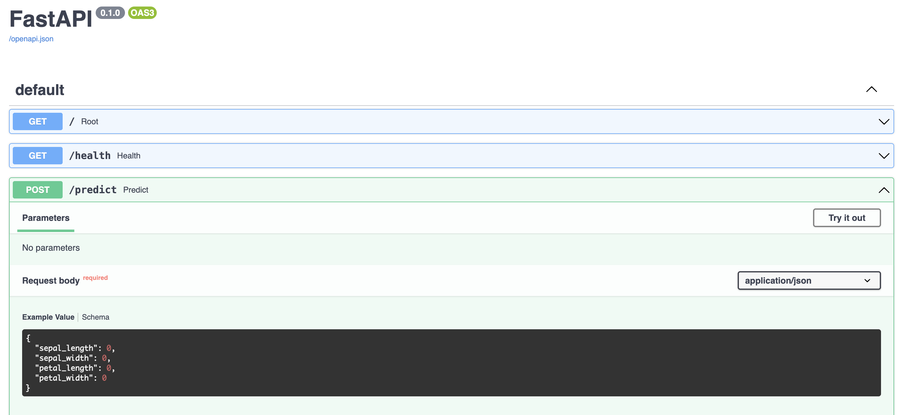

# MLOps course code repository

## Model servers

### FastAPI

A pre-requisite is to create a conda environment with the required dependencies. The `requirements.txt` file contains the dependencies.

```bash
cd model-servers/
conda create -n model-servers python=3.12
conda activate model-servers # or source activate model-servers
pip install -r requirements.txt
pip install ipykernel
```

#### Fast-api-tutorial

```bash
cd fast-api-tutorial/
python app/app.py
```

Now the FastAPI server is running on `http://localhost:8000`.

To access the API documentation, go to `http://localhost:8000/docs`.



Now you can try the model server by sending a POST request to `http://localhost:8000/predict` with the following payload:

```json
{
  "sepal_length": 0,
  "sepal_width": 0,
  "petal_length": 0,
  "petal_width": 0
}
```

Using curl:

```bash
curl -X 'POST' \
  'http://localhost:8000/predict' \
  -H 'accept: application/json' \
  -H 'Content-Type: application/json' \
  -d '{
  "sepal_length": 0,
  "sepal_width": 0,
  "petal_length": 0,
  "petal_width": 0
}'
```

Or using Python:

```python
import requests

url = "http://localhost:8000/predict"

payload = {
  "sepal_length": 0,
  "sepal_width": 0,
  "petal_length": 0,
  "petal_width": 0
}
headers = {
  'accept': 'application/json',
  'Content-Type': 'application/json'
}

response = requests.request("POST", url, headers=headers, json=payload)

print(response.text)
```

Or using the "Try it out" button in the API documentation.


## MLServer

MLServer is a model server that allows you to deploy models in a production environment. It is a high-performance model server that can serve models in real-time.
MLServer is not compatible with Windows.
Use linux or MacOS. Alternatively, you can use WSL2 on Windows or Google Colab.

To use it on Google Colab, open the notebook on the Google Colab interface.
Upload the model.pkl file to the Colab environment.
Run the notebook cells.